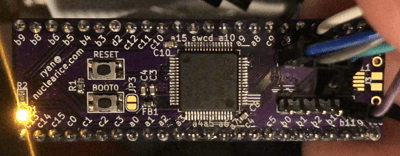

# stm32\_qfp64\_blink

Super simple starting point to get PlatformIO building a libopencm3-based blinky example program for my [stm32\_qfp64\_breakout](https://github.com/ryanbarry/stm32_qfp64_breakout) board with a STM32F205RG chip installed on it.

# Demo

